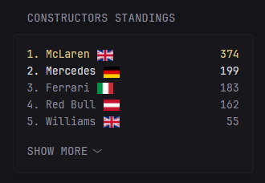

The yml file in this directory creates the following Glance widget.

Please make sure to update the .yml with your local IP. There are two references to {LOCAL_IP} which you must change and add the IP of your API. If glance and your glance-f1 are on the same PC, then you can replace with localhost, otherwise you should specify the local IP. 

If you're not a fan of the flag aesthetic, you can delete the img tag in the yml that calls to flagcdn.com. The API also shows the number of wins for the constructor if you want to display that as well. 

If you want to adjust the number of teams displayed by default before going to "show more", then you can edit the ul tag where it references "data-collapse-after."

