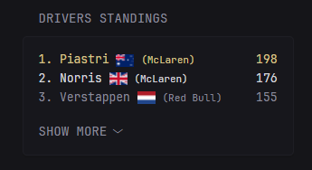

The yml file in this directory creates the following Glance widget.

Please make sure to add an environment variable called "F1_API_URL" that would contain your local IP. If Glance and glance-F1 are on the same computer, then you can specify local host, otherwise the local IP. If you prefer not to use environment variables, you need to edit each of the widget yamls and remove ${F1_API_URL} with your IP.

If you're not a fan of the flag aesthetic, you can delete the img tag in the yml that calls to flagcdn.com. 

If you want to adjust the number of drivers displayed by default before going to "show more", then you can edit the ul tag where it references "data-collapse-after."

