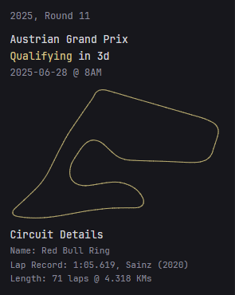
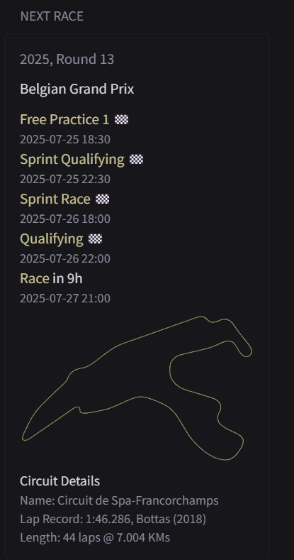

The yml file in this directory creates the following Glance widget.

Please make sure to update the .yml with your local IP. There are two references to {LOCAL_IP} which you must change and add the IP of your API. If glance and your glance-f1 are on the same PC, then you can replace with localhost, otherwise you should specify the local IP. 

Additional fields you can add from the API might be "first participation year", constructor that has the fastest lap, etc. 

Optional styles with f1_nextrace_moredetail.yml:

