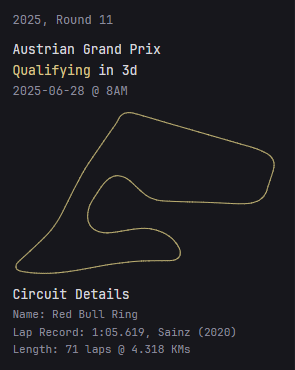
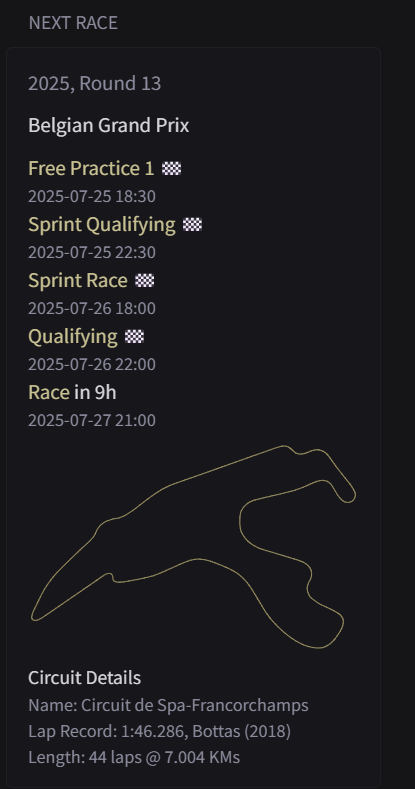

The yml file in this directory creates the following Glance widget.

Please make sure to add an environment variable called "F1_API_URL" that Glance can use to reach the API. If Glance runs in Docker and the API port is published on the host, this may be `host.docker.internal`.

The track map is loaded by the browser, so also add "F1_API_PUBLIC_URL" with a browser-reachable host such as `localhost` when browsing on the same machine, or your server's LAN IP when browsing from another device. If you prefer not to use environment variables, edit each widget YAML and replace `${F1_API_URL}` and `${F1_API_PUBLIC_URL}` manually.

Additional fields you can add from the API might be "first participation year", constructor that has the fastest lap, etc. 

Optional styles with f1_nextrace_moredetail.yml:

